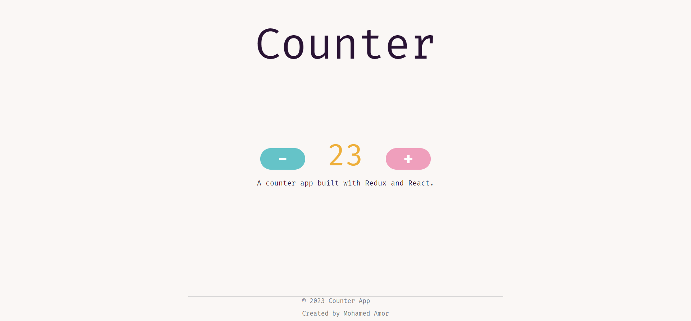

# Counter App with Redux and React

Welcome to the Counter App, a simple yet powerful demonstration of how Redux and React can work together seamlessly to manage state in your web applications. This app's design is created using Tailwind CSS and enhanced with Daisy UI.




## Features

- **Increment and Decrement:** Easily increase or decrease the count with intuitive buttons.
- **Redux-Powered:** Leveraging Redux for state management, ensuring a robust and scalable app architecture.
- **React Components:** Built with React components, allowing for a highly modular and maintainable codebase.
- **Elegant Design:** A clean and user-friendly interface crafted using Tailwind CSS and Daisy UI for a delightful user experience.

## Getting Started

1. **Clone the Repository:**

   ```bash
   git clone https://github.com/your-username/counter-app.git
   cd counter-app
   npm install
   npm start
   Open Your Browser:
   Visit http://localhost:3000 in your web browser to start using the Counter App.

## Usage
Click the "+" button to increment the count.
Click the "-" button to decrement the count.
Watch as Redux efficiently manages and updates the state.

## License
This project is licensed under the MIT License.


